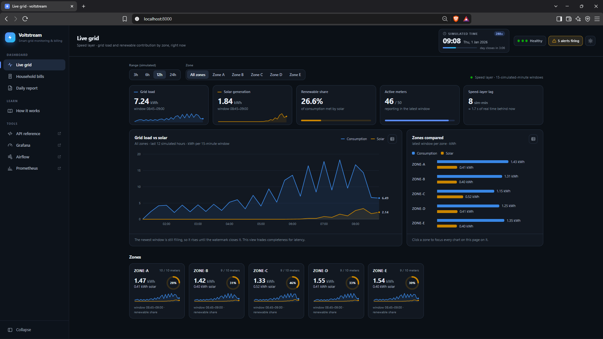
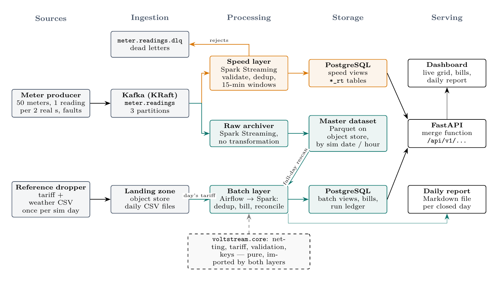
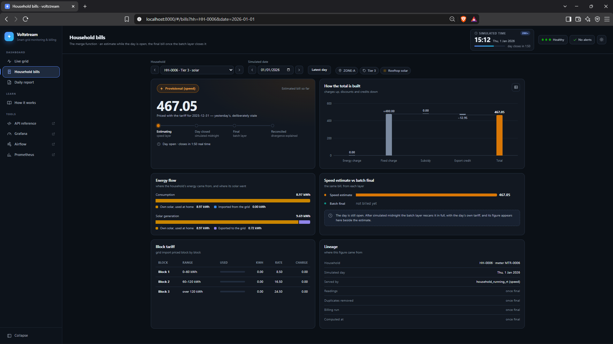
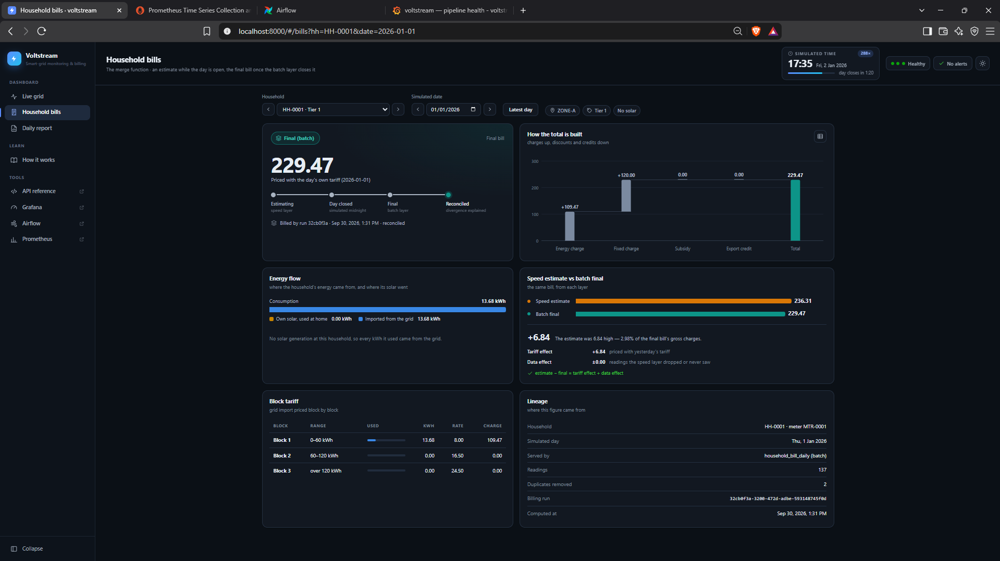
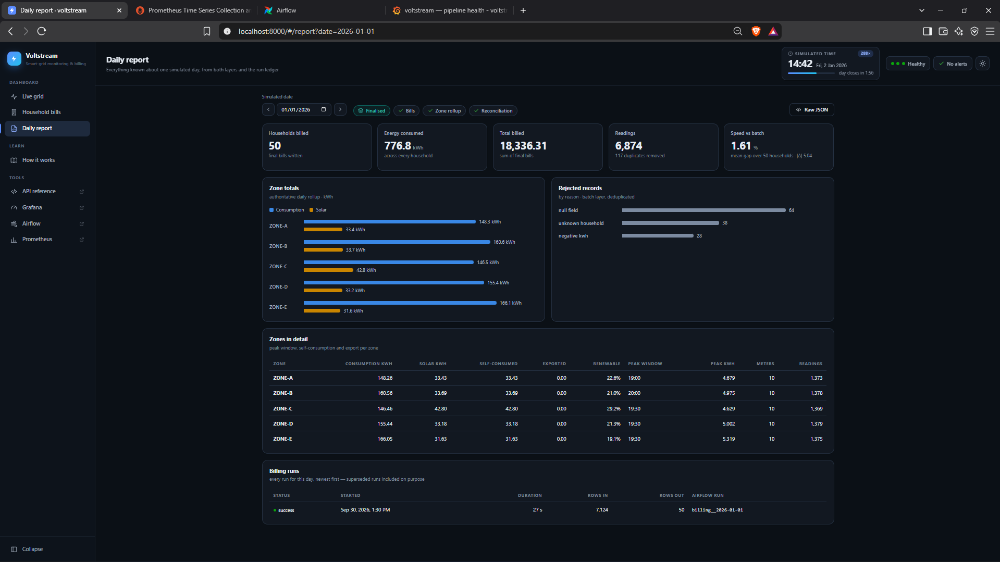
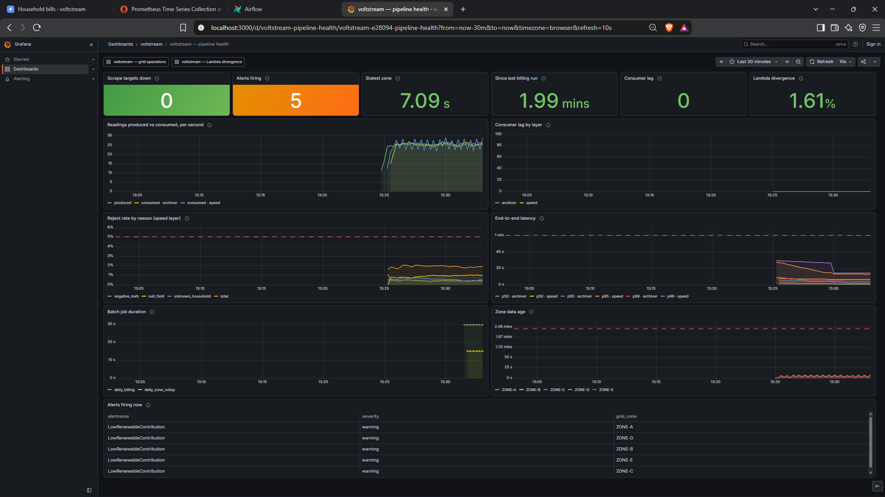
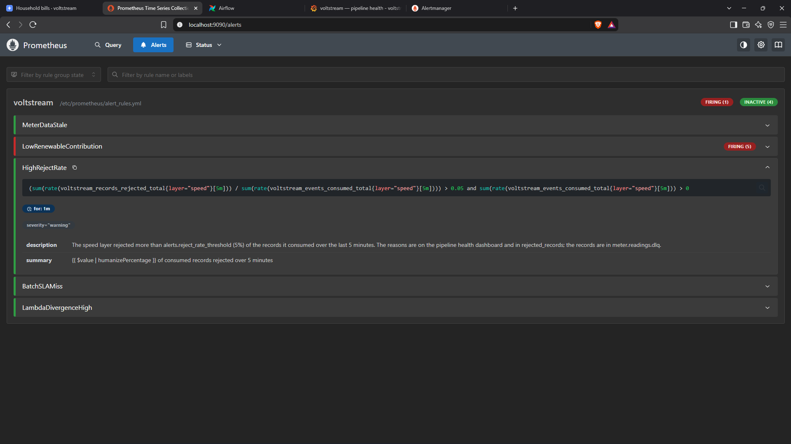
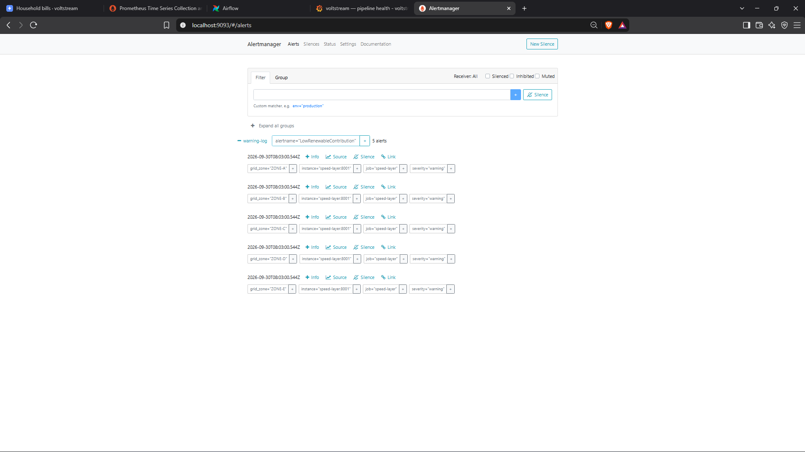
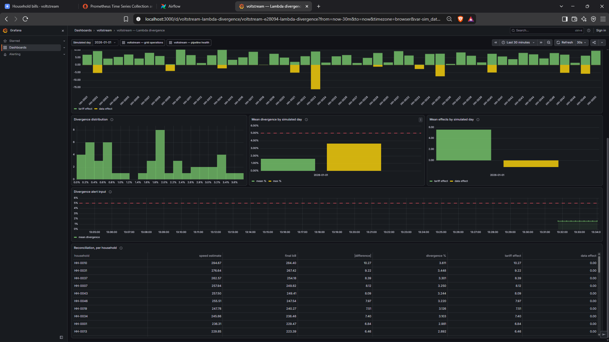
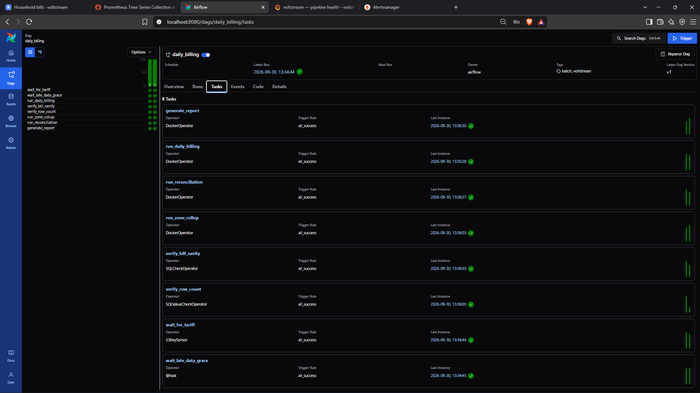

# ⚡ Voltstream

[](https://github.com/Malee-Fonseka/voltstream/actions/workflows/ci.yml)


**Real-time grid monitoring and exact daily billing from one smart-meter stream.**
A Lambda-architecture data platform built for EC8203 Applied Big Data Engineering
(University of Ruhuna), Use Case 3: *Smart Grid Energy Monitoring & Billing*.



<table>
<tr>
<td width="33%"><b>⚡ Live in seconds</b><br>Grid load and solar share per zone, about 6 s behind the meters.</td>
<td width="33%"><b>🧾 Exact bills, daily</b><br>The batch layer re-bills each closed day from the raw data with that day's tariff.</td>
<td width="33%"><b>🔔 Watched end to end</b><br>JSON logs, 10 metrics, 5 alert rules and 3 Grafana dashboards.</td>
</tr>
</table>

```powershell
git clone https://github.com/Malee-Fonseka/voltstream.git
cd voltstream
.\scripts\voltstream.ps1 run      # Linux / WSL: make up
# then open http://localhost:8000
```

## Contents

1. [What this project is](#1-what-this-project-is)
2. [Before you start](#2-before-you-start)
3. [Start and run the entire system](#3-start-and-run-the-entire-system)
4. [The dashboard: what each part shows](#4-the-dashboard-what-each-part-shows)
5. [Step-by-step scenarios](#5-step-by-step-scenarios)
6. [Run the tests](#6-run-the-tests)
7. [Troubleshooting](#7-troubleshooting)
8. [Reference: services, commands, code map](#8-reference)

---

## 1. What this project is

Fifty simulated households each have a smart meter that reports electricity use and rooftop
solar every few seconds. A tariff file arrives once a day. The platform has to answer two
questions with opposite needs:

- **Grid operators** want load and renewable share per zone **within seconds**. An
  approximate answer now beats a perfect one later.
- **Billing** wants an **exact, auditable** figure per household per day, using that
  day's tariff, including readings that arrived late. That can only be computed after
  the day closes.

A Lambda architecture serves both from one stream:

<p align="center">
  
</p>

- The **speed layer** answers in seconds. It is deliberately approximate: it prices bills
  with yesterday's tariff (today's does not exist yet) and drops very late readings.
- The **batch layer** waits for the day to close, rescans the whole day from the immutable
  master dataset, applies the day's own tariff and produces the authoritative bill.
- The **API merges the two**: it returns the batch bill if the day is finalised, otherwise
  the speed estimate, and every response says which one it is. The dashboard shows this
  as a badge that flips from **Provisional (speed)** to **Final (batch)**.
- A **reconciliation** job then explains the gap between estimate and final bill, split
  into a *tariff effect* (yesterday's prices) and a *data effect* (readings the speed layer
  missed).

**Key facts:** 50 households in 5 grid zones · readings every 2 real seconds · **one
simulated day = 5 real minutes** (time runs 288× faster) · 15-simulated-minute windows ·
faults injected on purpose (duplicates, late, invalid and missing readings) · Prometheus,
Alertmanager (5 alert rules) and Grafana (3 dashboards) watch every stage.

**Tech:** Kafka (KRaft), Spark 3.5 Structured Streaming and batch, MinIO-compatible object
storage, Airflow 3, PostgreSQL 16, FastAPI, Prometheus, Alertmanager, Grafana, Docker
Compose. The full design argument is in
[docs/architecture/00-master-design.md](docs/architecture/00-master-design.md).

---

## 2. Before you start

| You need | Why / how to check |
|---|---|
| **Docker Desktop**, running, with **at least 8 GB of memory (10 GB recommended)** and 4+ CPUs | 15 long-running containers use 5.3–6.4 GB. Check: `docker info --format "{{.MemTotal}} {{.NCPU}}"` |
| **Git** (on Windows: Git for Windows, which includes **Git Bash**) | The demo, fault, backfill and crash scripts are bash scripts |
| **Windows:** PowerShell (built in) | All commands in this guide are given for `scripts\voltstream.ps1` |
| **Linux / WSL:** `make` and GNU bash | The same steps exist as `make` targets. macOS is untested: the scripts use GNU `date` and `sed` |
| **Free ports** 3000, 5432, 8000, 8011, 8012, 8080, 9000, 9001, 9090, 9091, 9093, 29092 | Nothing else may listen on them |
| Python 3.11 and Java 17 | **Only** for running the test suite (section 6). Not needed to run the system |

**Give Docker enough memory (Windows).** Docker Desktop gets half the machine's RAM by
default. To give it 10 GB, create `C:\Users\<you>\.wslconfig` containing:

```ini
[wsl2]
memory=10GB
```

Then run `wsl --shutdown` and start Docker Desktop again. With less memory the stack still
runs, but a billing run can stall and be retried.

**If PowerShell refuses to run the script**, allow local scripts once:

```powershell
Set-ExecutionPolicy -Scope CurrentUser RemoteSigned
```

---

## 3. Start and run the entire system

### Step 1 — Get the code

```bash
git clone https://github.com/Malee-Fonseka/voltstream.git
cd voltstream
```

### Step 2 — Create the environment file

```bash
cp .env.example .env        # PowerShell: Copy-Item .env.example .env
```

Nothing needs editing: every value is a safe local default. The start command also creates
`.env` if it is missing.

### Step 3 — Build and start everything

**Windows (PowerShell):**

```powershell
.\scripts\voltstream.ps1 run
```

**Linux / WSL:**

```bash
make up
```

This builds the three images (app, Spark, Airflow), starts all containers and **waits for
their health checks** before returning. The first build downloads a lot (PySpark, the
Airflow base image) and takes several minutes. Later starts take about a minute.

> `run` wipes any previous data first and asks you to type `yes` if some exists
> (`-Force` skips the question). To resume a stopped stack without wiping it, use `start`
> instead (see the table at the end of this section).

When it finishes it prints where to look. Keep this table handy:

| What | URL | Login |
|---|---|---|
| **Dashboard** | <http://localhost:8000/> | none |
| API reference (OpenAPI) | <http://localhost:8000/docs> | none |
| Grafana (3 dashboards) | <http://localhost:3000/> | none needed to view |
| Airflow | <http://localhost:8080/> | user `admin`; the password is generated at start: `.\scripts\voltstream.ps1 status` prints it, or `docker exec voltstream-airflow cat /opt/airflow/simple_auth_manager_passwords.json.generated` |
| Prometheus | <http://localhost:9090/> (alerts: `/alerts`) | none |
| Alertmanager | <http://localhost:9093/> | none |
| MinIO console | <http://localhost:9001/> | `voltstream` / `voltstream-dev` |

### Step 4 — Wait for the pipeline to fill up

Simulated time starts at **2026-01-01 00:00** at the moment the stack starts, and one
simulated day lasts **5 real minutes**. Day 1 (2026-01-01) is partial, because the
containers start a little after the clock. **Day 2 (2026-01-02) is the first complete
day.**

| Real time after start | What happens | Where to see it |
|---|---|---|
| 10–20 s | First 15-minute windows reach Postgres | Dashboard → Live grid fills in |
| ~2 min | All metrics flowing | Grafana → *pipeline health*: no targets down, lag ≈ 0 |
| 5 min | First simulated midnight: day 1 closes, its tariff file lands | Dashboard clock pulses, a toast says the day closed |
| ~6–8 min | Day 1 billed by the batch layer | Airflow → `daily_billing` run green; dashboard badge for 2026-01-01 turns **Final** |
| ~10–13 min | Day 2, the first complete day, billed **and reconciled** | Dashboard → Household bills, date 2026-01-02: estimate vs final with the tariff/data effects; Grafana → *Lambda divergence* |
| Every simulated night | `LowRenewableContribution` fires (no sun) and clears after dawn | **Expected, not a fault** |

### Step 5 — Verify it is healthy

**Windows:**

```powershell
.\scripts\voltstream.ps1 status     # clock, containers, how far the pipeline has got
.\scripts\voltstream.ps1 check      # checks every stage end to end (~30 s)
```

Run `check` after about 13 minutes. It should end with **0 failed**. `WAIT` lines mean
"not expected yet at this point in the simulated day" — run it again later. If it
shows a failure *during* a billing run, the laptop was briefly overloaded: re-run it a
minute later.

**Linux / WSL** (no `status`/`check` equivalent; ask the API directly):

```bash
curl -s localhost:8000/health/ready        # {"ready":true,...}
curl -s localhost:8000/api/v1/clock        # the simulated clock
curl -s localhost:8000/api/v1/zones/load   # five zones, updating every few seconds
```

### Stop, resume, reset

| Windows | Linux / WSL | Effect |
|---|---|---|
| `.\scripts\voltstream.ps1 stop` | `make down` | Stop the containers, **keep all data** |
| `.\scripts\voltstream.ps1 start` | `docker compose --env-file .env -f docker/docker-compose.yml up -d --wait` | Resume on the same clock. Simulated time kept running while stopped, so there is a gap in the data |
| `.\scripts\voltstream.ps1 clean` | `make clean` | Delete containers **and all data** |
| `.\scripts\voltstream.ps1 run` | `make clean && make up` | Start over from nothing |
| `.\scripts\voltstream.ps1 logs -Service speed-layer` | `make logs s=speed-layer` | Follow one service's logs |

> On Linux, do not use `make up` on a stack that already holds data: it always stamps a new
> clock and restarts simulated time at 2026-01-01 on top of days that were already billed.
> Resume with the `docker compose … up` line above (it keeps the clock in `.env`), or
> `make clean` first.

---

## 4. The dashboard: what each part shows

Open <http://localhost:8000/>. It asks the API for fresh data every 5 seconds; nothing is
pushed to it. The page has four tabs in the left-hand menu. The menu collapses to icons
with the **Collapse** button, and becomes a slide-out drawer (☰) on a phone.

**Colours mean the same thing everywhere:** amber = speed layer / provisional,
teal = batch layer / final, blue = consumption, yellow = solar, violet = exported energy.
Every chart shows exact values on hover, and every chart card has a **table** button
(▦) that shows the same data as a table.

### The header (on every tab)

| Element | What it shows |
|---|---|
| **Simulated time** | The simulated clock (UTC), its date, the speed-up (`288×`), a progress bar through the simulated day and a real-time countdown: *day closes in m:ss*. It pulses at simulated midnight and a toast announces the closed day |
| **Health** (three dots) | API, PostgreSQL and object storage: green up, red down. Hover for details |
| **Alerts chip** | *No alerts*, *N alerts firing* (amber for warnings, red if any is critical), or *Alerts unknown* if Alertmanager cannot be reached. Click it to show the list |
| **Alert banner** | Appears under the header while an alert fires: severity, rule name, summary and since when. ✕ hides it until the set of alerts changes |
| ☀ / ☾ | Switch between light and dark themes (remembered in this browser) |

### Tab 1 — Live grid (speed layer)

What the grid is doing right now, from the speed layer's 15-minute windows (screenshot at
the top of this page).

| Element | What it shows |
|---|---|
| **Range** and **Zone** filters | How many simulated hours to show (3/6/12/24) and which zone. Every figure on the tab follows them |
| **Grid load** / **Solar generation** tiles | kWh consumed / generated in the latest 15-minute window, with a trend line |
| **Renewable share** | Solar as a share of consumption, capped at 100%. Drops to 0% every simulated night |
| **Active meters** | Meters that reported in the latest window, out of the known households |
| **Speed-layer lag** | How far the newest window trails simulated now (simulated minutes, and in real seconds). Normally a few seconds of real time; it climbs steadily if the producer or speed layer stops |
| **Grid load vs solar** | Consumption and solar per 15-minute window over the chosen range. Hover for exact values; the arrow keys step through windows |
| **Zones compared** | Consumption and solar per zone in the latest window. Click a zone to focus the whole tab on it |
| **Zone cards** | Per zone: latest kWh, solar, renewable-share ring, trend, meters reporting. Click to focus |

### Tab 2 — Household bills (the merge function)

One household's bill for one simulated day, from whichever layer can answer.

| While the day is open: **Provisional (speed)** | After the batch layer closes it: **Final (batch)** |
|---|---|
|  |  |

| Element | What it shows |
|---|---|
| **Household** dropdown | All 50 households grouped by zone, with tier, solar and subsidy. ‹ › step through them |
| **Simulated date**, **Latest day** | The day to bill. ‹ › step a day; *Latest day* jumps to the newest day with data. The URL updates, so a view can be shared (`#/bills?hh=HH-0003&date=2026-01-02`) |
| **Badge** | **Provisional (speed)** while the day is open or not yet billed; **Final (batch)** once the batch layer has closed it. It flips in place, with a toast, while you watch |
| **Total and tariff note** | The bill total, and which day's tariff priced it: yesterday's for a provisional bill, the day's own for a final one |
| **Lifecycle** | Estimating → Day closed → Final → Reconciled, with the current step highlighted, and a countdown to the day's close while it is open |
| **How the total is built** | A waterfall: energy charge + fixed charge − subsidy − export credit = total |
| **Energy flow** | Consumption split into own solar used and grid import; solar split into own use and export |
| **Speed estimate vs batch final** | Both figures side by side, the difference and its percentage of the gross charges. Once reconciled: the **tariff effect** plus the **data effect**, which add up to the difference exactly |
| **Block tariff** | Grid import priced block by block (0–60, 60–120, over 120 kWh) with rate and charge |
| **Lineage** | Which table answered, readings counted, duplicates removed, billing run id, when it was computed |

### Tab 3 — Daily report

Everything known about one simulated day, from both layers and the run ledger.



| Element | What it shows |
|---|---|
| **Date** and **status** | *Finalised* or *Partial*, plus which sections exist yet: Bills, Zone rollup, Reconciliation. *Raw JSON* opens the API response |
| **Tiles** | Households billed, energy consumed, total billed, readings (and duplicates removed), mean speed-vs-batch divergence |
| **Zone totals** | Authoritative daily consumption and solar per zone |
| **Rejected records** | Invalid readings by reason: the batch layer's figures once the day is billed, the speed layer's until then |
| **Zones in detail** | Per zone: self-consumed, exported, renewable share, peak window and meters |
| **Billing runs** | Every billing run for the day, newest first, including *superseded* runs from a restatement, with the Airflow run id |

### Tab 4 — How it works

A self-contained explanation for someone new to the project.

| Element | What it shows |
|---|---|
| **The pipeline** | An animated diagram. Connections draw in the order data flows, then dots travel the two paths: amber and frequent on the speed path, teal and once a "day" on the batch path. **Click any stage** for what it does and why |
| **Follow a reading** | A 9-step guided tour of one meter reading from the meter to the bill (**Next**/**Back** or the arrow keys). ↻ replays the animation |
| **Reference cards** | Speed vs batch layer compared, the merge function, simulated-time conversions, the faults injected on purpose, observability and a glossary |

---

## 5. Step-by-step scenarios

Each scenario lists what to run, how long it takes and what to watch. They assume the stack
is running (section 3). Unless noted, **let at least one day be billed first** (about
8 minutes after start).

The scripted scenarios **undo their own changes** when they finish, even if you press
Ctrl+C. Windows commands are shown; the Linux equivalent is given beneath each.

### 5.1 Watch the live grid (2 minutes)

1. Open the dashboard → **Live grid**.
2. Watch the tiles and the chart update every few seconds.
3. Click **Zone C** (or a zone card): every tile, the chart and the bars now show only
   ZONE-C. Click it again to go back to all zones.
4. Hover the *Grid load vs solar* chart to read any window; press ▦ to see it as a table.
5. Wait for simulated evening (see the header clock): solar and the renewable share fall to
   zero at night and come back after dawn.

### 5.2 Watch a bill go from provisional to final (up to 8 minutes)

This is the Lambda merge in action: the same request, answered first by the speed layer,
then by the batch layer.

**By hand, on the dashboard:**

1. Open **Household bills**, pick any household, and click **Latest day** (today in
   simulated time).
2. The badge says **Provisional (speed)**, the tariff note says *yesterday's*, and the
   lifecycle shows *Day open · closes in m:ss*.
3. Leave the page open. When the header countdown reaches 0:00, the lifecycle moves to
   *Day closed · waiting for the batch layer*.
4. About 1½–3 minutes later (a 90-second grace period for late data, then the billing job)
   the badge **flips to Final (batch)**, a toast shows the estimate and the final total,
   and *Speed estimate vs batch final* shows both.
5. Some minutes later reconciliation runs and the lifecycle reaches **Reconciled**, with
   the tariff and data effects shown.

**Scripted, in the terminal:**

```powershell
.\scripts\voltstream.ps1 demo                          # Linux: make demo
```

It shows HH-0001's provisional bill, waits for the day to close and be billed, shows the
final bill and the delta (tariff effect + data effect), then points at the dashboard.
It needs no input and takes up to about 7 minutes.

**Or from the terminal, one request at a time:**

```powershell
.\scripts\voltstream.ps1 bill -Household HH-0007                    # today: PROVISIONAL
.\scripts\voltstream.ps1 bill -Household HH-0007 -Date 2026-01-02   # a billed day: FINAL
```

### 5.3 Understand why estimate and final differ (after ~13 minutes)

1. **Household bills** → any household → date **2026-01-02** (the first complete day).
2. *Speed estimate vs batch final* shows the difference, split into:
   - **Tariff effect**: the speed layer used 2026-01-01's tariff;
   - **Data effect**: readings the speed layer dropped because they arrived too late.
3. **Daily report** → 2026-01-02 → the *Speed vs batch* tile shows the mean divergence
   across all 50 households (typically 1.5–2%).
4. Grafana → *Lambda divergence* dashboard plots the same over time.

### 5.4 Trigger each alert

There are five alert rules. Each scenario below injects one fault, **checks that the
alert actually fires in Alertmanager**, then undoes the fault.

| Alert | Severity | Fault | Time to fire | Scenario |
|---|---|---|---|---|
| `MeterDataStale` | critical | Meter producer stopped | ~3 min | `stale` |
| `HighRejectRate` | warning | 15% of readings sent invalid (normally 1%) | ~2 min | `rejects` |
| `BatchSLAMiss` | critical | Billing DAG paused | 15 min after the last billing | `sla` |
| `LowRenewableContribution` | warning | None: happens every simulated night | at dusk | `renewable` |
| `LambdaDivergenceHigh` | warning | 60% of readings sent 3–5 simulated hours late | 8–13 min | `divergence` |

| Grafana: pipeline health (5 alerts firing at simulated night) | Prometheus: the five rules and their state |
|---|---|
|  |  |
| **Alertmanager: `LowRenewableContribution` for all five zones** | **Grafana: Lambda divergence (speed estimate vs final bill)** |
|  |  |

**Where to watch any of them:**

- **Dashboard:** the alerts chip turns amber or red and the banner lists the alert.
- **Alertmanager** (<http://localhost:9093/>): the alert with its labels. If one seems
  missing, tick *Inhibited*: some alerts are deliberately silenced by others.
- **Grafana → pipeline health** → *Alerts firing now*.
- **The API log**, where Alertmanager's notifications land:
  ```powershell
  docker logs -f voltstream-api 2>&1 | Select-String '"stage": "alert"'
  ```
  Linux: `docker logs -f voltstream-api 2>&1 | grep '"stage": "alert"'`

**Run all five in one go** (about 30 minutes):

```powershell
.\scripts\voltstream.ps1 faults                        # Linux: make faults
```

**Or one at a time:**

#### a) Stale data — `MeterDataStale` (about 4 minutes)

```powershell
.\scripts\voltstream.ps1 faults -Scenario stale        # Linux: make faults s=stale
```

- **What it does:** stops the meter producer, waits for the alert, starts it again.
- **What you see:** on **Live grid** the *Speed-layer lag* climbs steadily and the charts
  stop moving. About 3 minutes later the banner shows **MeterDataStale** (critical), for
  all five zones in one notification. After the restart the lag drops back and the alert
  resolves within a minute.
- **By hand, without the script:** `docker stop voltstream-meter-producer`, wait about
  3 minutes, then `docker start voltstream-meter-producer`.

#### b) Too many rejected readings — `HighRejectRate` (about 3 minutes)

```powershell
.\scripts\voltstream.ps1 faults -Scenario rejects      # Linux: make faults s=rejects
```

- **What it does:** restarts the producer so 15% of readings have a missing field, then
  restores it.
- **What you see:** after about 2 minutes, **HighRejectRate** (warning) at a reject ratio
  near 11%. **Daily report** → today → *Rejected records*: the *null field* bar grows.

#### c) Billing late — `BatchSLAMiss` (15–17 minutes)

```powershell
.\scripts\voltstream.ps1 faults -Scenario sla          # Linux: make faults s=sla
```

- **What it does:** pauses the `daily_billing` DAG in Airflow, waits for the alert, then
  unpauses it.
- **What you see:** days keep closing but none gets billed. On **Household bills**,
  yesterday stays *Provisional* at *Day closed · waiting for the batch layer*; **Daily
  report** shows it as *Partial*. 15 minutes after the last successful billing,
  **BatchSLAMiss** (critical) fires. After the unpause, Airflow catches up, the waiting
  days turn **Final** and the alert clears.

#### d) Low renewables — `LowRenewableContribution` (up to 7 minutes)

```powershell
.\scripts\voltstream.ps1 faults -Scenario renewable    # Linux: make faults s=renewable
```

- **What it does:** nothing is broken. Solar is zero between 18:00 and 06:00 simulated, so
  the script waits for the alert at dusk (or its clearing after dawn) and asserts it.
- **What you see:** **Live grid** → *Renewable share* falls to 0% and the zone rings
  empty. The alert fires per zone around 19:00–20:00 simulated and clears around 10:00.

#### e) Speed and batch disagree — `LambdaDivergenceHigh` (8–13 minutes)

```powershell
.\scripts\voltstream.ps1 faults -Scenario divergence   # Linux: make faults s=divergence
```

- **What it does:** restarts the producer so 60% of readings arrive 3–5 simulated hours
  late: far past the speed layer's 30-minute watermark (so it drops them) but still
  within the batch layer's full-day rescan.
- **What you see:** once a day under the fault is reconciled, **Household bills** for
  that day shows a much larger difference, almost all of it **data effect**, and **Daily
  report** → *Speed vs batch* is well above 5%.
- **Caveat:** this one needs the most memory. On an 8 GB Docker allocation the
  reconciliation run can stall, so leave it out of a live demo on a small machine.

**Screenshots as evidence (Windows):** `.\scripts\voltstream.ps1 faults -Capture` keeps
each alert firing for a minute and screenshots the dashboard, Grafana, Alertmanager and
Prometheus into `docs/report/screenshots/`.

### 5.5 Crash the speed layer (7–10 minutes)

Shows that losing the fast layer costs freshness, never correctness.

```powershell
.\scripts\voltstream.ps1 killtest                      # Linux: make kill-test
```

1. The script kills the speed layer abruptly (SIGKILL) in the middle of a day.
2. **Live grid**: *Speed-layer lag* climbs and the charts freeze. The raw archiver keeps
   writing the master dataset in the meantime (the script prints how many readings).
3. The script restarts the speed layer: it resumes from its checkpoint and catches up
   within about 20 seconds, and the lag returns to normal.
4. **Household bills** for an already-final day never changes, and the day of the crash is
   billed in full once it closes, because billing reads the master dataset, not the
   speed layer.

### 5.6 Restate a day with a corrected tariff (6–8 minutes)

Shows that a wrong input is fixed by recomputing, never by patching, and that the history
is kept.

1. Pick a day **billed at least two simulated days ago** (a day's tariff is also the speed
   layer's input for the next day, so that day must be over too). For example, once the
   header clock shows 2026-01-05 or later (about 20 minutes after start), use
   `2026-01-02`.
2. Run:
   ```powershell
   .\scripts\voltstream.ps1 backfill -Date 2026-01-02   # Linux: make backfill d=2026-01-02
   ```
3. The script corrupts that day's tariff file, rebills the day (every bill becomes wrong),
   restores the file, rebills again (every bill goes back to the cent), and prints the
   three versions side by side.
4. **Daily report** → 2026-01-02 → *Billing runs*: **superseded → superseded → success**,
   each with its own Airflow run (`billing__2026-01-02`, `…__r1`, `…__r2`).
5. **Household bills** → any household on 2026-01-02 → *Lineage* shows the newest run id.

### 5.7 Explore the pipeline (5 minutes)

1. Dashboard → **How it works**. Watch the diagram draw itself, then the packets flow.
2. Click **Speed layer**, then **Batch layer**: the panel below explains each stage, and
   the diagram highlights its connections.
3. Click **Follow a reading** and step through the nine stages with **Next** or the
   → key.

### 5.8 Query the API directly

Everything the dashboard shows comes from these endpoints; the interactive reference is at
<http://localhost:8000/docs>. In Windows PowerShell type `curl.exe`, not `curl`.

```bash
curl -s localhost:8000/api/v1/clock                                        # simulated now
curl -s localhost:8000/api/v1/zones/load                                   # latest window per zone
curl -s "localhost:8000/api/v1/zones/history?minutes=360"                  # last 6 simulated hours
curl -s localhost:8000/api/v1/households                                   # the 50 households
curl -s "localhost:8000/api/v1/households/HH-0001/bill?date=2026-01-02"    # merged bill: see "source"
curl -s "localhost:8000/api/v1/households/HH-0001/bill/delta?date=2026-01-02"
curl -s "localhost:8000/api/v1/reports/daily?date=2026-01-02"
curl -s localhost:8000/api/v1/alerts/status
curl -s localhost:8000/health/ready
```

In a bill, `"source": "speed", "provisional": true` means an estimate; `"source": "batch",
"provisional": false` means final.

### 5.9 Look inside the other tools

| Tool | What to open |
|---|---|
| **Grafana** | *pipeline health* (throughput, lag, rejects, latency, alerts), *grid operations* (load and renewables by zone), *Lambda divergence* (estimate vs final over time) |
| **Airflow** | `tariff_watcher` (checks for new tariff files every real minute) and `daily_billing` → Graph: the billing, rollup, reconciliation and report tasks (below) |
| **MinIO console** | `voltstream-raw/meter_readings/sim_date=…/hour=…` (the master dataset), `voltstream-landing/tariff/` (daily tariff files), `voltstream-archive/reports/` (daily report files) |
| **Prometheus** | `/alerts` for the five rules and their state, `/targets` for what is scraped |



---

## 6. Run the tests

Needs Python 3.11 and Java 17 (for the PySpark tests), not Docker:

```bash
python -m venv .venv                                   # Windows: py -3.11 -m venv .venv
.venv/bin/pip install -e ".[dev,api,sim,spark]"        # Windows: .venv\Scripts\pip ...
make test                                              # or: .venv/bin/python -m pytest -m "not integration"
```

| Command | What runs | Needs |
|---|---|---|
| `make test` | Unit, property and consistency tests, including the pure-Python vs Spark billing check | Python and Java; no Docker |
| `make coverage` | The same, with CI's gate: `core/` must stay at 100% coverage | as above |
| `make lint` | ruff and mypy | Python |
| `make check-alerts` | promtool on the alert rules and their unit tests, amtool on the routing | Docker |
| `make test-all` | Everything, including the integration tests: producer to Kafka, the batch job end to end on committed fixtures with hand-computed bills, the merge function, archiver restart | the stack up |
| `make cold-starts` | Five starts from nothing, asserting no container crash-loops | Docker; **destroys** the stack's data |
| `make cold-start` | A fresh clone, images rebuilt with no cache, the demo run with no manual steps | Docker; **destroys** the stack's data |

CI ([.github/workflows/ci.yml](.github/workflows/ci.yml)) runs the first four (lint, the
tests with the coverage gate, and the alert checks) on every push and pull request.

---

## 7. Troubleshooting

| Symptom | Fix |
|---|---|
| Start times out / a service is not healthy | `.\scripts\voltstream.ps1 status`, then `logs -Service <name>` for the failing one. Most often Docker has too little memory (section 2) |
| Simulated dates are months or years in the future | The clock anchor in `.env` is stale. `clean` then `run` (Linux: `make clean && make up`). Never start with a bare `docker compose up`: it skips the anchor |
| After the laptop sleeps, simulated time has jumped and `BatchSLAMiss` fires | Expected: hours asleep are weeks simulated. It clears after the next billing run; for a tidy demo, `clean` and `run` |
| `check` shows a FAIL during a billing run | The Spark batch containers briefly starve the machine. Re-run `check` a minute later |
| An alert Grafana shows is missing in Alertmanager | It is silenced by another alert (e.g. no sun *because* no data). Tick *Inhibited* in Alertmanager |
| `LowRenewableContribution` fires every few minutes | Every simulated night has no solar. Expected |
| A bash script says it cannot find `docker`, or rewrites paths like `/opt/...` | Run it through `voltstream.ps1`, which uses Git Bash and sets the right options |
| An image build fails on `files.pythonhosted.org` | Docker's DNS stalled. Restart Docker Desktop and build again |

The full list, with causes, is in [docs/runbook.md](docs/runbook.md) §8.

---

## 8. Reference

### Services

| Service | Port | What it does |
|---|---|---|
| `kafka` | 29092 | Event log; 3 partitions, ~7 day retention |
| `postgres` | 5432 | Serving layer: speed and batch views |
| `minio` | 9000 / 9001 | Master dataset and the daily landing zone. Runs `pgsty/silo`, a MinIO-compatible fork, since MinIO stopped publishing images (decision D8) |
| `meter-producer` | — | 50 meters, one reading each per 2 real seconds, with injected faults |
| `reference-dropper` | — | One tariff and weather file per simulated day |
| `raw-archiver` | 8011 | Kafka → Parquet, no transformation whatsoever |
| `speed-layer` | 8012 | Windowed zone metrics and the provisional bill |
| `api` | 8000 | Serving API, OpenAPI docs and the dashboard |
| `airflow` | 8080 | Orchestration: a watcher bills each simulated day as its tariff lands, and each billing run starts Spark in its own container |
| `docker-socket-proxy` | — | Lets Airflow start those containers without access to the Docker socket itself |
| `prometheus` | 9090 | Scrapes the services' metrics and evaluates the five alert rules |
| `alertmanager` | 9093 | Routes firing alerts back to the API's webhook |
| `pushgateway` | 9091 | Holds the metrics of batch containers that exit before a scrape |
| `sql-exporter` | — | Serving-layer facts as metrics: data age per zone, last billing success (D9) |
| `grafana` | 3000 | Pipeline health, grid operations and Lambda divergence dashboards |

### Commands

| Windows (`.\scripts\voltstream.ps1 …`) | Linux / WSL | Does |
|---|---|---|
| `run` | `make clean && make up` | Wipe, build, start fresh |
| `start` / `stop` / `clean` | `docker compose --env-file .env -f docker/docker-compose.yml up -d --wait` / `make down` / `make clean` | Resume / stop keeping data / delete everything |
| `status`, `check [-Date d]` | — | Where the pipeline has got to; end-to-end verification |
| `bill -Household HH-0001 [-Date d]` | `curl` (section 5.8) | One bill and which layer served it |
| `logs -Service s` | `make logs s=s` | Follow a service's logs |
| `demo` | `make demo` | Provisional → final → delta (5.2) |
| `faults [-Scenario s] [-Capture]` | `make faults [s=s]` | Trigger and assert alerts (5.4) |
| `killtest` | `make kill-test` | Crash and recover the speed layer (5.5) |
| `backfill -Date d` | `make backfill d=d` | Restate a billed day (5.6) |
| `capture [-Label x]` | — | Screenshot the evidence pages |

### Simulated time

One simulated day takes **5 real minutes** (`time_scale: 288`). Every `event_ts`,
`sim_date` and window boundary is simulated time (UTC); only latency metrics use the wall
clock. `VOLTSTREAM_ANCHOR_REAL` in `.env` is the real instant simulated time is measured
from. The start commands stamp it for a fresh stack and keep it for a stack with data.
Starting with a bare `docker compose up` skips that, so always use the scripts or `make`.

### Where to look in the code

| Looking for | Start here |
|---|---|
| Lambda vs Kappa, and why | [00-master-design.md](docs/architecture/00-master-design.md) §4 |
| Decisions the design left open | [05-open-decisions.md](docs/architecture/05-open-decisions.md) D1–D9 |
| Billing logic, shared by both layers | [src/voltstream/core/](src/voltstream/core/) |
| That the two layers agree | [tests/consistency/test_pure_vs_spark.py](tests/consistency/test_pure_vs_spark.py) |
| Ingestion | [simulators/](src/voltstream/simulators/), [streaming/sources.py](src/voltstream/streaming/sources.py) |
| The master dataset | [streaming/raw_archiver.py](src/voltstream/streaming/raw_archiver.py) |
| Stream processing | [streaming/speed_layer.py](src/voltstream/streaming/speed_layer.py) |
| Batch processing | [batch/](src/voltstream/batch/), [airflow/dags/](airflow/dags/) |
| Serving layer and the merge function | [storage/repositories.py](src/voltstream/storage/repositories.py), [api/routers/households.py](src/voltstream/api/routers/households.py) |
| The dashboard | [dashboard/](dashboard/): plain HTML, CSS and ES modules, no build step |
| Observability | [metrics.py](src/voltstream/metrics.py), [logging_setup.py](src/voltstream/logging_setup.py), [04-observability.md](docs/architecture/04-observability.md) |
| Demo script, fault drills, what to say | [docs/runbook.md](docs/runbook.md) |
| Measured limitations, honestly | [docs/assumptions.md](docs/assumptions.md) |

### What is deliberately simplified

Fifty households, single-broker Kafka, single-node Spark, no schema registry, secrets in
`.env`. The simulated clock compresses event time but not processing time, which has a
measured consequence: about 1% of a day's energy never reaches the 15-minute operational
view, while the daily totals stay complete.

Every simplification, and what it would cost to remove, is in
[docs/assumptions.md](docs/assumptions.md). Nothing there is an oversight we are hoping
goes unnoticed.
